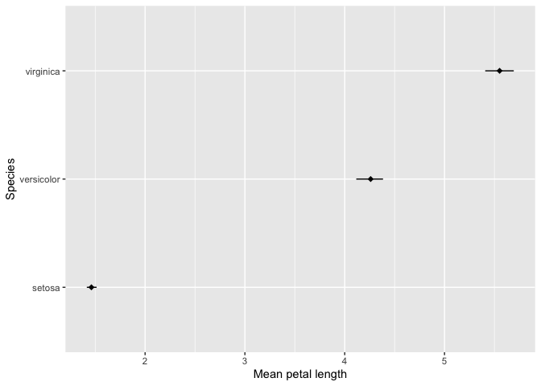

<!-- README.md is generated from README.Rmd. Please edit that file -->

sbwtools
========

<!-- badges: start -->
<!-- badges: end -->

**sbwtools** is a package containing my most frequently used custom
functions.

System Information
------------------

Updated on 2020-06-09 02:17:33

``` r
sessioninfo::platform_info()
#>  setting  value                       
#>  version  R version 3.6.3 (2020-02-29)
#>  os       macOS Mojave 10.14.6        
#>  system   x86_64, darwin15.6.0        
#>  ui       X11                         
#>  language (EN)                        
#>  collate  en_US.UTF-8                 
#>  ctype    en_US.UTF-8                 
#>  tz       America/New_York            
#>  date     2020-06-09
```

Installation
------------

sbwtools is only available from [GitHub](https://github.com/). Install
with:

``` r
# install.packages("devtools")
devtools::install_github("sbw78/sbwtools")
```

Function examples
-----------------

`ci_df`: Build a dataframe with the mean and confidence intervals of a
continuous variable, with optional grouping.

``` r
library(sbwtools)
library(dplyr)
#> 
#> Attaching package: 'dplyr'
#> The following objects are masked from 'package:stats':
#> 
#>     filter, lag
#> The following objects are masked from 'package:base':
#> 
#>     intersect, setdiff, setequal, union
ci_data <- iris %>% 
  as_tibble() %>% 
  ci_boot_df(., Petal.Length, Species)
```

`ci_boot_df`: Same as `ci_df`, but with bootstrapped sampling

``` r
ci_boot_data <- iris %>% 
  as_tibble() %>% 
  ci_boot_df(., Petal.Length, Species)
```

`custom_kable`: Customized `knitr::kable` output.

``` r
custom_kable(ci_data, caption = "Summarized data from iris",
             col.names = c("Species", "n", "Petal Length", "Lower CI", "Upper CI", "sd"))

custom_kable(ci_data, caption = "Summarized data from iris",
             col.names = c("Species", "n", "Petal Length", "Lower CI", "Upper CI", "sd")) %>% 
  kableExtra::footnote(general = "1000 bootstrapped samples")
```

`format_pval`: Format p-values (i.e. “\< .001” for values less than
.001).

``` r
fit <- lm(Sepal.Length ~ Species, data = iris)
summary_df <- summary(fit) %>% broom::tidy()

# Without formatting p-value
summary_df
#> # A tibble: 3 x 5
#>   term              estimate std.error statistic   p.value
#>   <chr>                <dbl>     <dbl>     <dbl>     <dbl>
#> 1 (Intercept)           5.01    0.0728     68.8  1.13e-113
#> 2 Speciesversicolor     0.93    0.103       9.03 8.77e- 16
#> 3 Speciesvirginica      1.58    0.103      15.4  2.21e- 32

# Formatted p-value
mutate(summary_df, p.value = format_pval(p.value))
#> # A tibble: 3 x 5
#>   term              estimate std.error statistic p.value
#>   <chr>                <dbl>     <dbl>     <dbl> <chr>  
#> 1 (Intercept)           5.01    0.0728     68.8  < .001 
#> 2 Speciesversicolor     0.93    0.103       9.03 < .001 
#> 3 Speciesvirginica      1.58    0.103      15.4  < .001
```

`hh`: Get first 5 rows and first 5 columns of a data frame or matrix

`ht`: Get the first 10 rows and last 10 rows of a data frame or matrix.

``` r
hh(iris)
#>   Sepal.Length Sepal.Width Petal.Length Petal.Width Species
#> 1          5.1         3.5          1.4         0.2  setosa
#> 2          4.9         3.0          1.4         0.2  setosa
#> 3          4.7         3.2          1.3         0.2  setosa
#> 4          4.6         3.1          1.5         0.2  setosa
#> 5          5.0         3.6          1.4         0.2  setosa

ht(iris)
#>     Sepal.Length Sepal.Width Petal.Length Petal.Width   Species
#> 1            5.1         3.5          1.4         0.2    setosa
#> 2            4.9         3.0          1.4         0.2    setosa
#> 3            4.7         3.2          1.3         0.2    setosa
#> 4            4.6         3.1          1.5         0.2    setosa
#> 5            5.0         3.6          1.4         0.2    setosa
#> 6            5.4         3.9          1.7         0.4    setosa
#> 7            4.6         3.4          1.4         0.3    setosa
#> 8            5.0         3.4          1.5         0.2    setosa
#> 9            4.4         2.9          1.4         0.2    setosa
#> 10           4.9         3.1          1.5         0.1    setosa
#> 141          6.7         3.1          5.6         2.4 virginica
#> 142          6.9         3.1          5.1         2.3 virginica
#> 143          5.8         2.7          5.1         1.9 virginica
#> 144          6.8         3.2          5.9         2.3 virginica
#> 145          6.7         3.3          5.7         2.5 virginica
#> 146          6.7         3.0          5.2         2.3 virginica
#> 147          6.3         2.5          5.0         1.9 virginica
#> 148          6.5         3.0          5.2         2.0 virginica
#> 149          6.2         3.4          5.4         2.3 virginica
#> 150          5.9         3.0          5.1         1.8 virginica
```

`install_load_packages`: This function will check for each package in
the user-defined and install them if they are missing, and then load
them. It also takes a list of github packages and their repos.

``` r
packages <- c("tidyverse", "devtools")
github_packages <- list(package = c("fancyCorr", "report"),
                        repo = c("sbw78/fancyCorr", "easystats/report"))

install_load_packages(packages, github_packages)
```

`last`: Get the last element of a vector or list

``` r
last(letters)
#> [1] "z"
```

`make_forest_plot`: Build a forest plot.

``` r
p <- make_forest_plot(ci_data, mean_Petal.Length, Species, xlab = "Mean petal length",
                 ylab = "Species", ci_low = ci_low, ci_high = ci_high)

p
```



`regex_build`: Combine a character vector into a single regex list.

``` r
regex_build(c("apples", "oranges", "bananas"))
#> [1] "\\bapples\\b|\\boranges\\b|\\bbananas\\b"
regex_build(c("apples", "passion fruit", "oranges"), modifier = "multi")
#> [1] "\\s*?\\bapples\\b\\s*?|\\s*?\\bpassion fruit\\b\\s*?|\\s*?\\boranges\\b\\s*?"
```

`se`: Calculate standard error.

``` r
se(iris$Sepal.Length)
#> [1] 0.06761132
```
